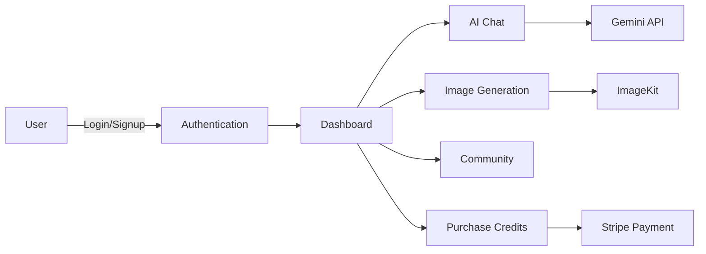

<div align="center">


# NEURA SERVER

<p align="center">
  <em>Powerful backend infrastructure for AI-powered conversations and image generation</em>
</p>

[](https://opensource.org/licenses/MIT)
[](https://github.com/JOSIAHTHEPROGRAMMER/Neura-server/stargazers)
[](https://github.com/JOSIAHTHEPROGRAMMER/Neura-server/network)
[](http://makeapullrequest.com)

</div>

---

## Overview

**Neura Server** is a robust Node.js/Express backend that powers the Neura AI platform. It provides secure authentication, AI chat integration with Google Gemini, image generation capabilities, and a flexible credit-based payment system through Stripe.

> **Frontend Repository:** [Neura](https://github.com/JOSIAHTHEPROGRAMMER/Neura)

---

## Application Flow

<div align="center">



</div>

---

## Features

### Authentication & Security

- **JWT Authentication** - Secure token-based user sessions
- **Password Hashing** - Bcrypt encryption for user credentials
- **Protected Routes** - Middleware-based route protection
- **Password Recovery** - Email-based password reset flow
- **Token Refresh** - Automatic session management

### AI Integration

- **Google Gemini API** - Advanced natural language processing
- **Context Management** - Multi-turn conversation handling
- **Streaming Responses** - Real-time AI message streaming
- **Error Handling** - Graceful API failure management
- **Rate Limiting** - API usage throttling

### Image Generation

- **ImageKit Integration** - Cloud-based image storage and delivery
- **AI Image Creation** - Text-to-image generation
- **Image Upload** - Secure file handling and validation
- **CDN Delivery** - Fast image serving worldwide
- **Community Sharing** - Public/private image management

### Payment System

- **Stripe Integration** - Secure payment processing
- **Webhook Handling** - Real-time payment verification
- **Credit Management** - Flexible credit allocation system
- **Multiple Plans** - Tiered pricing structure
- **Transaction History** - Complete payment tracking

### Database Management

- **MongoDB** - NoSQL database for flexible data storage
- **Mongoose ODM** - Schema validation and modeling
- **Indexes** - Optimized query performance
- **Data Relationships** - Efficient document references

---

## Tech Stack

<div align="center">


</div>

### Core Technologies

- **Node.js 20** - JavaScript runtime environment
- **Express.js** - Fast, minimalist web framework
- **MongoDB 6** - NoSQL database
- **Mongoose** - MongoDB object modeling

### Security & Authentication

- **jsonwebtoken** - JWT token generation and verification
- **bcrypt.js** - Password hashing and encryption
- **cors** - Cross-origin resource sharing
- **helmet** - Security headers middleware

### Third-Party Services

- **Google Gemini AI** - Natural language processing
- **ImageKit** - Image storage and delivery CDN
- **Stripe** - Payment processing platform
- **Nodemailer** - Email sending for password recovery

---

## Installation

### Prerequisites

```bash
Node.js >= 20.5
MongoDB >= 6.0
npm or yarn
```

### Quick Start

1. **Clone the repository**

```bash
git clone https://github.com/JOSIAHTHEPROGRAMMER/Neura-server.git
cd Neura-server
```

2. **Install dependencies**

```bash
npm install
```

3. **Environment Setup**

Create a `.env` file in the root directory:

```ini
# Server Configuration
PORT=5000
NODE_ENV=development

# Database
MONGO_URI=your_mongodb_connection_string

# Authentication
JWT_SECRET=your_super_secret_jwt_key
JWT_EXPIRE=7d

# ImageKit Configuration
IMAGEKIT_PUBLIC_KEY=your_imagekit_public_key
IMAGEKIT_PRIVATE_KEY=your_imagekit_private_key
IMAGEKIT_URL_ENDPOINT=your_imagekit_url_endpoint

# Stripe Payment Gateway
STRIPE_SECRET_KEY=your_stripe_secret_key
STRIPE_PUBLISHABLE_KEY=your_stripe_publishable_key
STRIPE_WEBHOOK_SECRET=your_stripe_webhook_secret

# Google Gemini AI
GEMINI_API_KEY=your_gemini_api_key

# Email Configuration (Optional)
EMAIL_HOST=smtp.gmail.com
EMAIL_PORT=587
EMAIL_USER=your_email@gmail.com
EMAIL_PASS=your_email_password

# Frontend URL (for CORS)
CLIENT_URL=http://localhost:5173
```

4. **Start the server**

Development mode with hot reload:

```bash
npm run dev
```

Production mode:

```bash
npm start
```

5. **Verify the server**

The API will be running at `http://localhost:5000`

---

## Project Structure

```
Neura-server/
├── configs/
│   ├── database.js          # MongoDB connection configuration
│   ├── imagekit.js          # ImageKit client setup
│   └── stripe.js            # Stripe client configuration
├── controllers/
│   ├── authController.js    # Authentication logic
│   ├── chatController.js    # Chat management
│   ├── messageController.js # AI message handling
│   ├── creditController.js  # Payment and credits
│   └── userController.js    # User management
├── middleware/
│   ├── auth.js              # JWT verification middleware
│   ├── errorHandler.js      # Global error handling
│   └── validation.js        # Request validation
├── models/
│   ├── User.js              # User schema
│   ├── Chat.js              # Chat schema
│   ├── Message.js           # Message schema
│   ├── Credit.js            # Credit transaction schema
│   └── Image.js             # Generated image schema
├── routes/
│   ├── authRoutes.js        # Authentication endpoints
│   ├── chatRoutes.js        # Chat endpoints
│   ├── messageRoutes.js     # Message endpoints
│   ├── creditRoutes.js      # Payment endpoints
│   └── userRoutes.js        # User endpoints
├── utils/
│   ├── emailService.js      # Email sending utility
│   ├── tokenGenerator.js    # JWT token utilities
│   └── validators.js        # Input validation helpers
├── .env                      # Environment variables
├── .gitignore
├── server.js                 # Application entry point
└── package.json
```

---

## API Endpoints

### Authentication Routes

| Method | Endpoint             | Description             | Auth Required |
| ------ | -------------------- | ----------------------- | ------------- |
| `POST` | `/api/auth/register` | Create new user account | ❌            |
| `POST` | `/api/auth/login`    | User login              | ❌            |
| `POST` | `/api/auth/logout`   | User logout             | ✅            |
| `GET`  | `/api/auth/verify`   | Verify JWT token        | ✅            |
| `POST` | `/api/auth/refresh`  | Refresh access token    | ✅            |

### User Routes

| Method | Endpoint                          | Description               | Auth Required |
| ------ | --------------------------------- | ------------------------- | ------------- |
| `GET`  | `/api/user/profile`               | Get user profile          | ✅            |
| `PUT`  | `/api/user/profile`               | Update user profile       | ✅            |
| `GET`  | `/api/user/data`                  | Get user data and credits | ✅            |
| `GET`  | `/api/user/published`             | Get published images      | ❌            |
| `POST` | `/api/user/forgot-password`       | Request password reset    | ❌            |
| `POST` | `/api/user/reset-password/:token` | Reset password with token | ❌            |

### Chat Routes

| Method   | Endpoint              | Description                     | Auth Required |
| -------- | --------------------- | ------------------------------- | ------------- |
| `POST`   | `/api/chat/create`    | Create new chat session         | ✅            |
| `GET`    | `/api/chat/list`      | Get user's chat history         | ✅            |
| `GET`    | `/api/chat/:id`       | Get specific chat with messages | ✅            |
| `DELETE` | `/api/chat/:id`       | Delete a chat session           | ✅            |
| `PUT`    | `/api/chat/:id/title` | Update chat title               | ✅            |

### Message Routes

| Method | Endpoint               | Description             | Auth Required |
| ------ | ---------------------- | ----------------------- | ------------- |
| `POST` | `/api/message/text`    | Send text message to AI | ✅            |
| `POST` | `/api/message/image`   | Generate AI image       | ✅            |
| `POST` | `/api/message/stop`    | Stop ongoing AI request | ✅            |
| `GET`  | `/api/message/:chatId` | Get messages for a chat | ✅            |

### Credit Routes

| Method | Endpoint               | Description                    | Auth Required |
| ------ | ---------------------- | ------------------------------ | ------------- |
| `GET`  | `/api/credit/plans`    | Get available credit plans     | ❌            |
| `POST` | `/api/credit/purchase` | Create Stripe checkout session | ✅            |
| `POST` | `/api/credit/webhook`  | Handle Stripe webhook events   | ❌            |
| `GET`  | `/api/credit/balance`  | Get user credit balance        | ✅            |
| `GET`  | `/api/credit/history`  | Get transaction history        | ✅            |

---

## Database Schema

### User Model

```javascript
{
  username: String,
  email: String (unique),
  password: String (hashed),
  credits: Number (default: 10),
  role: String (default: 'user'),
  avatar: String,
  createdAt: Date,
  updatedAt: Date
}
```

### Chat Model

```javascript
{
  userId: ObjectId (ref: 'User'),
  title: String,
  messages: [ObjectId] (ref: 'Message'),
  createdAt: Date,
  updatedAt: Date
}
```

### Message Model

```javascript
{
  chatId: ObjectId (ref: 'Chat'),
  userId: ObjectId (ref: 'User'),
  role: String ('user' | 'assistant'),
  content: String,
  imageUrl: String,
  createdAt: Date
}
```

### Image Model

```javascript
{
  userId: ObjectId (ref: 'User'),
  prompt: String,
  imageUrl: String,
  imageKitId: String,
  isPublic: Boolean (default: false),
  likes: Number (default: 0),
  createdAt: Date
}
```

### Credit Transaction Model

```javascript
{
  userId: ObjectId (ref: 'User'),
  amount: Number,
  type: String ('purchase' | 'usage' | 'refund'),
  description: String,
  stripePaymentId: String,
  createdAt: Date
}
```

---

## Environment Variables

| Variable                 | Description                          | Required |
| ------------------------ | ------------------------------------ | -------- |
| `PORT`                   | Server port number                   | Yes      |
| `NODE_ENV`               | Environment (development/production) | Yes      |
| `MONGO_URI`              | MongoDB connection string            | Yes      |
| `JWT_SECRET`             | Secret key for JWT tokens            | Yes      |
| `JWT_EXPIRE`             | Token expiration time                | Yes      |
| `IMAGEKIT_PUBLIC_KEY`    | ImageKit public API key              | Yes      |
| `IMAGEKIT_PRIVATE_KEY`   | ImageKit private API key             | Yes      |
| `IMAGEKIT_URL_ENDPOINT`  | ImageKit CDN endpoint                | Yes      |
| `STRIPE_SECRET_KEY`      | Stripe secret API key                | Yes      |
| `STRIPE_PUBLISHABLE_KEY` | Stripe publishable key               | Yes      |
| `STRIPE_WEBHOOK_SECRET`  | Stripe webhook signing secret        | Yes      |
| `GEMINI_API_KEY`         | Google Gemini API key                | Yes      |
| `CLIENT_URL`             | Frontend application URL             | Yes      |
| `EMAIL_HOST`             | SMTP email host                      | No       |
| `EMAIL_PORT`             | SMTP email port                      | No       |
| `EMAIL_USER`             | Email account username               | No       |
| `EMAIL_PASS`             | Email account password               | No       |

---

## Middleware

### Authentication Middleware

```javascript
// Protects routes requiring authentication
const protect = async (req, res, next) => {
  // Verify JWT token from headers
  // Attach user to request object
  // Continue to next middleware
};
```

### Error Handler Middleware

```javascript
// Global error handling
const errorHandler = (err, req, res, next) => {
  // Log error details
  // Send appropriate error response
  // Handle specific error types
};
```

### Validation Middleware

```javascript
// Validates request data
const validateRequest = (schema) => {
  return (req, res, next) => {
    // Validate against schema
    // Return validation errors or continue
  };
};
```

---

## Stripe Integration

### Webhook Configuration

Set up a Stripe webhook endpoint pointing to:

```
https://your-domain.com/api/credit/webhook
```

**Events to listen for:**

- `checkout.session.completed` - Credit purchase successful
- `payment_intent.succeeded` - Payment confirmed
- `payment_intent.payment_failed` - Payment failed

### Test Cards

**Successful Payment:**

- Card Number: `4242 4242 4242 4242`
- CVC: Any 3 digits
- Expiry: Any future date
- ZIP: Any valid code

**Declined Payment:**

- Card Number: `4000 0000 0000 0002`

[Full test card documentation](https://stripe.com/docs/testing)

---

## Security Best Practices

### Implemented Security Measures

- JWT token-based authentication
- Password hashing with bcrypt (10 rounds)
- CORS configuration for allowed origins
- Helmet.js for security headers
- Rate limiting on sensitive endpoints
- Input validation and sanitization
- SQL injection prevention (NoSQL database)
- XSS protection
- Environment variable protection

### Recommendations

- Use HTTPS in production
- Implement rate limiting globally
- Regular security audits
- Keep dependencies updated
- Monitor API usage
- Implement logging and monitoring
- Use secrets management service

---

## Scripts

| Command        | Description                           |
| -------------- | ------------------------------------- |
| `npm start`    | Start production server               |
| `npm run dev`  | Start development server with nodemon |
| `npm run lint` | Run ESLint for code quality           |
| `npm test`     | Run test suite                        |

---

## Error Handling

### Standard Error Response Format

```json
{
  "success": false,
  "error": {
    "message": "Error description",
    "statusCode": 400
  }
}
```

### Standard Success Response Format

```json
{
  "success": true,
  "data": {
    // Response data
  }
}
```

---

## Deployment

### Prerequisites

- MongoDB Atlas account or self-hosted MongoDB
- Stripe account with API keys
- Google Cloud account with Gemini API access
- ImageKit account
- Node.js hosting service (Heroku, Railway, DigitalOcean, etc.)

### Environment Setup

1. Set all required environment variables in your hosting platform
2. Configure MongoDB connection string
3. Set up Stripe webhook endpoint
4. Configure CORS for your frontend domain

### Production Considerations

- Enable MongoDB connection pooling
- Implement request logging (Winston, Morgan)
- Set up error monitoring (Sentry, LogRocket)
- Configure automatic backups
- Implement caching strategy (Redis)
- Use process manager (PM2)
- Enable SSL/TLS certificates

---

## Contributing

Contributions are welcome! Here's how you can help:

1. **Fork the repository**
2. **Create a feature branch**
   ```bash
   git checkout -b feature/AmazingFeature
   ```
3. **Commit your changes**
   ```bash
   git commit -m 'Add some AmazingFeature'
   ```
4. **Push to the branch**
   ```bash
   git push origin feature/AmazingFeature
   ```
5. **Open a Pull Request**

Please ensure your code follows the existing style and includes appropriate tests.

---

## Testing

Run the test suite:

```bash
npm test
```

Run tests with coverage:

```bash
npm run test:coverage
```

---

## License

Distributed under the MIT License. See `LICENSE` for more information.

---

<div align="center">

## Contact & Support

[](https://www.linkedin.com/in/josiah-alexis-a958a0223)
[](mailto:josiahalexis15@gmail.com)
[](https://we-go-pass.vercel.app/)

**If you find this project helpful, please consider giving it a star!**

</div>

---

<div align="center">


**Frontend Repository:** [Neura](https://github.com/JOSIAHTHEPROGRAMMER/Neura)

</div>
